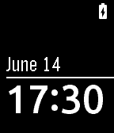
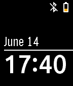
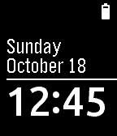
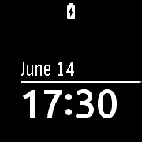
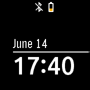
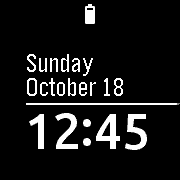

# Simplicity'

## Description

Based on the Simplicity watchface.

Changes:

- time uses Ubuntu font (antialiased)
- date uses Gothic font
- added battery status and Bluetooth connection indicators
- day of the week above the date (optional)

The status icons are based on Material icons by Google: https://fonts.google.com/icons?icon.set=Material+Icons

## Download

* Pebble Appstore: https://apps.repebble.com/557d63dba404afe20200000a
* Rebble Appstore: https://apps.rebble.io/en_US/application/557d63dba404afe20200000a

## Screenshots

### Basalt (Pebble Time, Pebble Time Steel)

  

### Chalk (Pebble Time Round)

  
